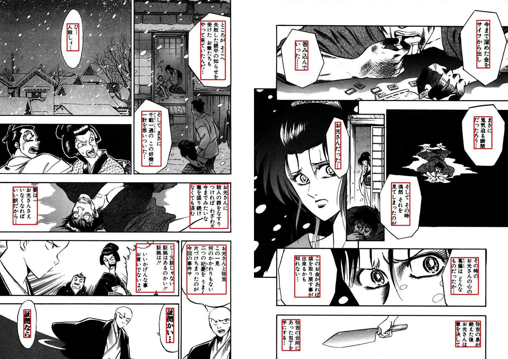
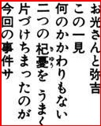

<h1>OCR manga API</h1>
<h2>Detection</h2>

tài về model detection <a href="#">tại đây</a> 

<h2>Recognition</h2>

<h3>input image:</h3>

<h3>result</h3>

お 光 さ ん と 弥 吉 こ の 一  
見 何 の か か わ り も な い 二 つ の 杞 憂 
を う ま く 片 づ け ち ま っ た の が 今 回 
の 事 件 は

